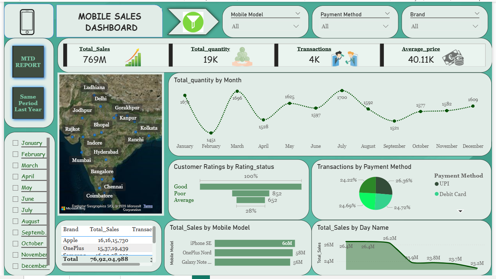
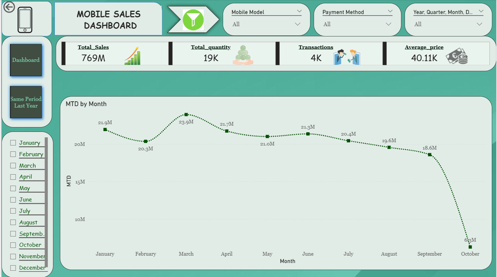
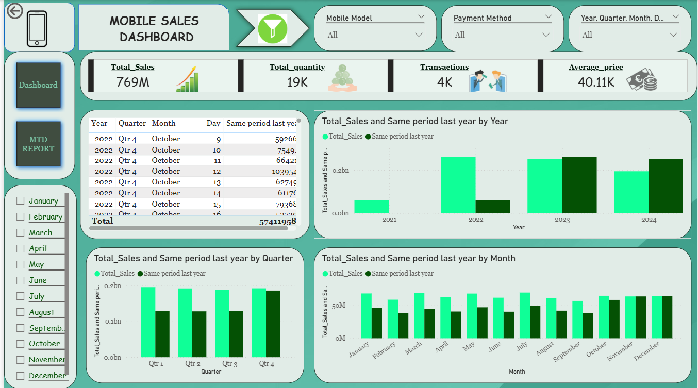

# Mobile Sales Dashboard - Power BI

An interactive Power BI dashboard created to analyze mobile sales performance using dynamic filters, DAX measures, and drill-down reporting.

## Features
- Interactive slicers for Mobile Model, Brand, Payment Method, Month, Quarter, and Year
- Drill-down from Year → Quarter → Month → Day
- DAX measures for:
  - MTD (Month-to-Date)
  - YTD (Year-to-Date)
  - Same Period Last Year
- KPI Cards:
  - Total Sales
  - Total Quantity
  - Transactions
  - Average Price
- Multi-page navigation
- Map visualization for city-wise sales analysis
- Sales analysis by:
  - Mobile Model
  - Payment Method
  - Customer Rating
  - Day Name

## Tools Used
- Power BI
- DAX
- Power Query
- Data Modeling

## Dashboard Preview

### Main Dashboard

### MTD Report

### Year-over-Year Comparison

## Project File
`Dashboard dax powerbi.pbix`
